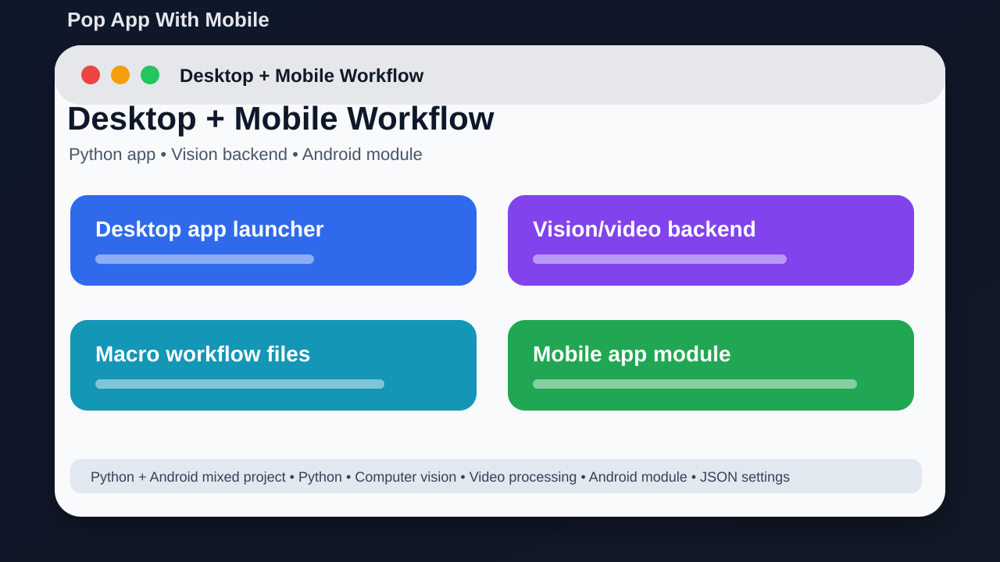

# Pop App With Mobile



## Short Description

A mixed desktop and mobile project with vision tools, macro work, and Android code.

## About This Project

Pop App With Mobile combines a Python desktop-style app, backend vision/video tools, macro/model workflow files, and an Android mobile app inside app/mobile.

The goal is to keep the project easy to understand, easy to run, and useful for learning or further development.

## Main Features

- Python main launcher
- Desktop-style app modules
- Backend vision and video processing
- Screen capture, OCR, heatmap, and goal matching code
- Macro/model workflow files
- Android mobile app module

## Tech Stack

- Python
- Computer vision
- Video processing
- Android module
- JSON settings

## Project Location

Main local folder:

```text
D:\PROJECTS\PopAppWithMobile
```

GitHub repository:

https://github.com/saifalian/PopAppWithMobile

## Project Structure

```text
app/           Python app and Android mobile folder
backend/       Vision, video, desktop, macro, and database modules
data/          Local macro/model data
main.py        Main launcher
settings.json  Local settings
```

## How To Run

1. Create a Python virtual environment.
2. Install requirements.txt.
3. Run python main.py.
4. Open app/mobile in Android Studio for the mobile part.
5. Keep generated recordings and model data out of Git.

## Screenshot

The image above is a clean project preview for GitHub. It shows the main idea of the project in a simple way.

## Current Status

This project is uploaded to GitHub and prepared as a portfolio-style repository. More improvements can be added later, such as real app screenshots, demo videos, releases, and issue templates.

## Safety Note

Keep large generated files out of the repository and test automation features on safe data first.

## License

No license file is included yet. Add a license before using this project as an open-source project.
